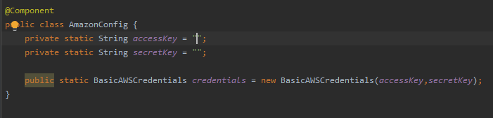
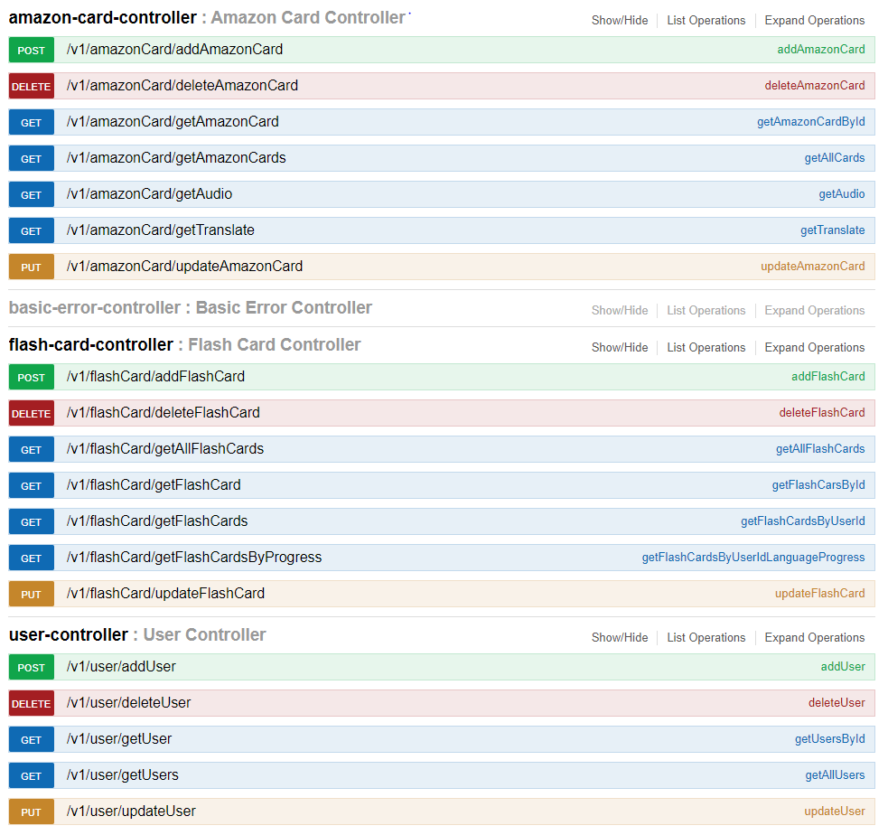

# FLashCards


This is backend Application of FleshCard Project. The frontend repository is https://github.com/DariuszKny/FlashCardsUi

Application is responsible to connect with frontEnd application and SQL Database 
App also is using two external services, Amazon Polly and Amazon Translate 

```
Becouse of AWS Policy Credentials can not be upload to public enviroment, so please provide accessKey and secredKey in the AmazonConfig Class
To get this credentials You can write to a mail to dariusz.knysak@gmail.com
```





